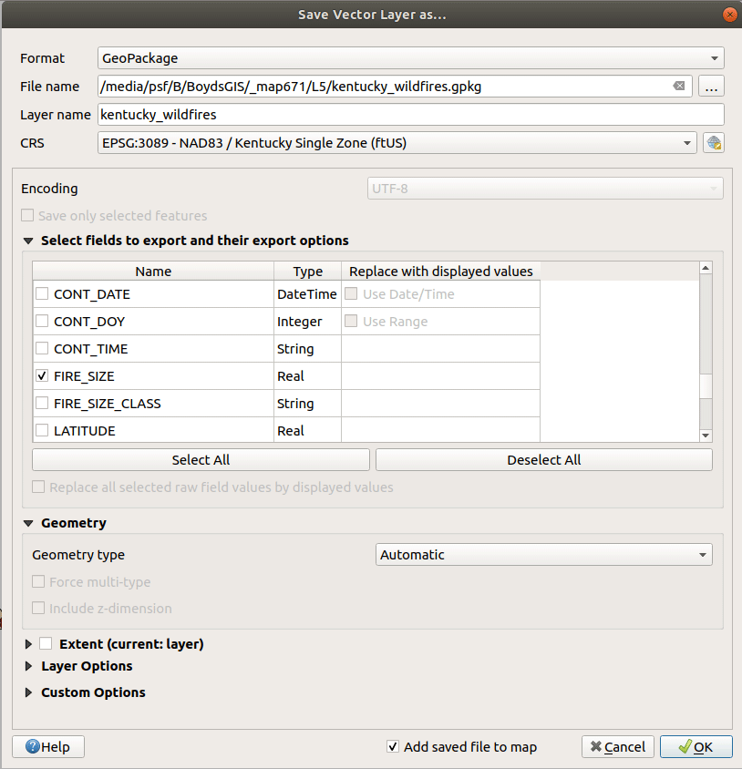
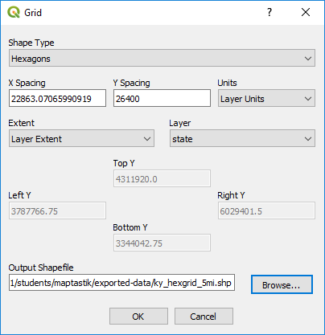
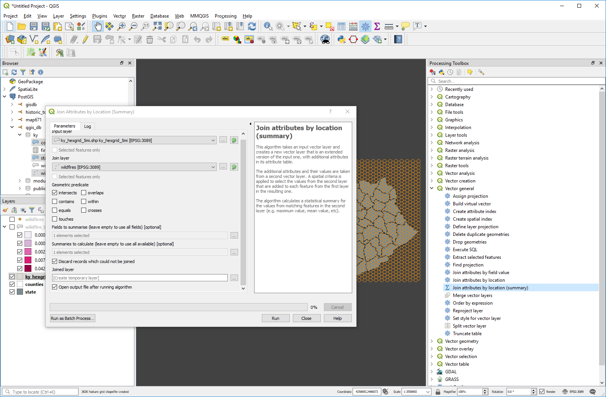

# Lesson 05: Spatial Joins, Hexbins, and Heat Mapping

## Table of Contents

<!-- TOC -->

- [Lesson 05: Spatial Joins, Hexbins, and Heat Mapping](#lesson-05-spatial-joins-hexbins-and-heat-mapping)
    - [Table of Contents](#table-of-contents)
    - [Overview](#overview)
    - [Data files](#data-files)
    - [Spatial join](#spatial-join)
        - [Using hexbins for thematic mapping](#using-hexbins-for-thematic-mapping)
    - [Coordinate Reference Systems](#coordinate-reference-systems)
        - [Selecting your coordinate system](#selecting-your-coordinate-system)
        - [Create a custom coordinate system](#create-a-custom-coordinate-system)
    - [Extracting our layers for analysis](#extracting-our-layers-for-analysis)
        - [Export to GeoPackage](#export-to-geopackage)
    - [Styling your preliminary map](#styling-your-preliminary-map)
    - [Join attributes by location (summary) tool](#join-attributes-by-location-summary-tool)
    - [Hex binning analysis](#hex-binning-analysis)
        - [Create hexagonal grid with the MMQGIS plugin](#create-hexagonal-grid-with-the-mmqgis-plugin)
            - [Spatial join wildfires to hexgrid](#spatial-join-wildfires-to-hexgrid)
            - [Styling your output](#styling-your-output)
        - [Many methods to visualize point data](#many-methods-to-visualize-point-data)
    - [PostGIS Option](#postgis-option)
        - [Extract to spatial database](#extract-to-spatial-database)
            - [Create three layers](#create-three-layers)
        - [Spatial joins in PostGIS](#spatial-joins-in-postgis)
        - [Spatial join and hex binning in SQL](#spatial-join-and-hex-binning-in-sql)
            - [Spatial join wildfires to hexgrid](#spatial-join-wildfires-to-hexgrid-1)
    - [Addendum I: Making a heat map in QGIS](#addendum-i-making-a-heat-map-in-qgis)
        - [Pseudocolor raster bands](#pseudocolor-raster-bands)
        - [Raster Layer widgets](#raster-layer-widgets)
        - [Weighted heatmap](#weighted-heatmap)
    - [Addendum II: Harness SQL for extended analysis and support](#addendum-ii-harness-sql-for-extended-analysis-and-support)
        - [Creating summary statistics and tables for export](#creating-summary-statistics-and-tables-for-export)
        - [Create a function to automate repetitive tasks](#create-a-function-to-automate-repetitive-tasks)
    - [Resources and references](#resources-and-references)

<!-- /TOC -->

## Overview

This module takes point-level data and explores analysis techniques for their thematic representation using QGIS in three methods: spatial joins with polygons of different sizes, spatial joins with tessellated hexagons (hex binning), and an optional section on heat mapping.

In this module, we will:

* Conduct an analysis of high-density point data
* Perform a spatial join, also know as a point in polygon analysis
* Load plugins for QGIS, notably MMQGIS
* Create hexagonal grids in QGIS  (and/or PostGIS)
* Use spatial indexes for queries
* Assess the different techniques for point data visualization


## Data files

This week we have a 'whopper' of a dataset:

* **[US Wildfires 1992-2013 GeoPackage](https://www.fs.usda.gov/rds/archive/products/RDS-2013-0009.4/RDS-2013-0009.4_GPKG.zip)**  from: Short, Karen C. 2017. Spatial wildfire occurrence data for the United States, 1992-2015 [FPA_FOD_20170508]. 4th Edition. Fort Collins, CO: Forest Service Research Data Archive. [https://www.fs.usda.gov/rds/archive/Product/RDS-2013-0009.4/](https://www.fs.usda.gov/rds/archive/Product/RDS-2013-0009.4/). Download, extract, and connect the GeoPackage in QGIS's Browser Panel.
* The county and state layers from Module 04.

## Spatial join

In a previous lesson, we joined attributes from different tables based on a field of shared values. In this lesson, we'll join attributes from different layers based on shared locations of their features. We'll do a _point in polygon_ or _many to one_ spatial join that will count the number points from one layer that are within polygons of another layer.

We have another type of spatial join, the _one to many_ which will join the attributes of the _one_ that intersects the _many_. Imagine if you GPS mapped public water fountains in your city and you want to add attributes from a polygon layer, e.g., city council districts. A _one to many_ spatial join would add the attributes of the council district to each intersecting water fountain point. We'll leave this type of join for another day.

The _many to one_ spatial join is easy to imagine for our lesson; we have locations of wildfires and we want to aggregate them by county to identify which county has the most wildfire. We will create summary statistics for our attributes, such as the average fire size by state or the largest fire in each county. Because our attribute table doesn't offer consistent information describing in which county the incident occurred, we will spatial join point to polygon to analyze patterns at different units of geography.

As we found in a previous lesson, if we map raw quantities, e.g., total acres burned in a county, we'll need to normalize by the size of the county. This requires that we divide the sum of the area burned by the county's area (being sure to convert the areas to same unit). This would create a choropleth map showing the ratio of county's area burned by wildfire. What if we joined wildfires to polygons of the same size? This technique is called hex binning and helps quickly visualize point density across an area.


### Using hexbins for thematic mapping


_Aggregating 100,000+ building records to regularly sized and spaced hexbins. Data courtesy of the City of Raleigh._

What are hexbins, aka hexagonal grids, and why are they cool for mappers? Hexagonal binning is a technique used to aggregate a large number of points into hexagonal grids. The method is similar to making a choropleth map, though rather than taking political boundaries as the aggregation unit, we tile equally-sized, adjacent, and non-overlapping polygons. The regular hexagon is our polygon of choice, so you should [review the hexagon's curious geometry](https://hexnet.org/content/hexagonal-geometry).

We'll create hexagonal grids using the MMQGIS plugin and/or the [PostGIS functions](https://carto.com/docs/tips-and-tricks/carto-functions/) developed by CARTO. A tiled grid can be comprised of squares, equilateral triangles, or hexagons.

With over 1.8 million records in our dataset, we will need a good way to visualize and analyze these points. We'll spatial join to aggregate by county and hexagonal grids.

Unlike our previous lessons, we will need to transform our layer's coordinate systems to a local or equal-area CRS.

## Coordinate Reference Systems

For displaying maps, we take advantage of QGIS's 'on the fly' projection capabilities to make our layers overlap regardless of the layer's source CRS. When we use geospatial algorithms that have distance as an input parameter, e.g., creating hexagons of a fixed size, we need to use a projected coordinate system with a linear unit of measure.

Most of the geospatial data we find online, especially small-scale vector data, is in either WGS 84 or NAD 83, which are geographic coordinate systems. These geographic coordinate systems are the standard for a web mapping workflow, and we'll always need to manage them properly. For example, we know that we need to export GeoJSONs in a WGS 84 CRS to use online. Try [geojson.io](http://geojson.io) to verify your web mapping layers.

However, a hexagon grid generated in WGS 84 or NAD 83 coordinate systems (EPSG: 4326 and EPSG: 4269, respectively) will not maintain equal areas for hexagons across a large area, which defeats the purpose of hex binning. So, we need to find a local projected coordinate to use in our analysis.


### Selecting your coordinate system

Let's review our projected coordinate reference systems and find a good CRS for our state. We call these local CRS as compared to global CRS. We have (generally) two families of local, projected CRSs we can use, Universal Transverse Mercator (UTM) and State Plane Coordinate System (SPCS).

UTM zones span the globe, based on the WGS 84 GCS, and use the meter as the linear unit of measure.  The State Plane Coordinate System was developed to maintain the highest level of measurement capability on maps of U.S. states. They are tuned to each state, and most states have multiple zones tuned to even smaller regions in that state. They are based on the NAD 83 GCS with multiple datum realizations (correcting for the shifting of North America due to plate tectonics) and offer both meter and feet linear units of measure.

Both families maximize the accuracy of measuring shape, distance, and area for the areas they cover. If we create a hexagon grid in one of these coordinate systems, then we're confident that our hexagons will maintain identical areas in any projection.

Which to use? UTM zones are pretty easy to use, but if you want foot as a linear unit of measure, you'll need an SPCS zone. If your state has many SPSC zones, generally the _Central Zone_ or _Single Zone_ will be good for the entire state. For example, Kentucky has a single zone SPSC (EPSG: 3089).

For small scale maps, we have used North America Albers Equal Area Conic projection (EPSG: 102008) and the Mollweide projection (EPSG: 54009), for example.

### Create a custom coordinate system

You can create a custom projection in QGIS. For example, if you wanted to tune the Albers equal-area conic projection to Hawaii's island chain (since it spans so many zones) you need to modify three projection parameters. First, copy the CRS definition in QGIS **Project Project > Properties > CRS** at the bottom:

```
+proj=aea +lat_1=20 +lat_2=60 +lat_0=40 +lon_0=-96 +x_0=0 +y_0=0 +datum=NAD83 +units=m +no_defs
```

Then go to the QGIS menu and find **Settings > Custom Projections...**. Paste the definition and give the new CRS a descriptive name. The _PROJ.4_ parameters that you'll need to change to focus on Hawaii:

* Central Meridian (*lon_0*) is the longitude where you want the map centered. Hawaii is -156&deg;.
* Standard Parallel 1 (*lat_1*) is the bottom of your area, 9&deg;
* Standard Parallel 2 (*lat_2*) is the top of your area, 36&deg;
* A third parallel might be given (*lat_0*) which is either a _Latitude of origin_ or _Latitude of center_. The later is between *lat_1* and *lat_2*. The _Latitude of center_ is 22.5&deg;.

An example CRS definition would be:

```
+proj=aea +lat_1=9 +lat_2=36 +lat_0=13.5 +lon_0=-156 +x_0=0 +y_0=0 +datum=NAD83 +units=m +no_defs
```

   
_Custom CRS for Hawaii island archipelago_

These parallel and meridian values don't have to be exact. Visit [epsg.io](http://epsg.io) and look at the _Well Known Text (WKT)_ for any CRS to discover the parameters. QGIS uses the _PROJ.4_ definition and our spatial database would use _SQL (PostGIS)_ definitions. For more details about _PROJ.4_ parameters, visit [http://proj4.org/](proj4.org).

## Extracting our layers for analysis

In our workflow, we'll extract features for our area of interest (from datasets in NAD 83 or WGS 84) to a new layer in the desired projected coordinate system. Because we're doing analysis with multiple layers, we need to make sure they are all in the same projected CRS. If we want to publish our results to an interactive web map, then we'll eventually **Export > Save Features As...** the analysis output layer to GeoJSON with the EPSG:4326 spatial reference ID.

Let's connect the "FPA_FOD_20170508.gpkg" database by opening Q's **Browser Panel** and right-clicking **GeoPackage > New Connection...**  and then navigate your file finder to the downloaded and unzipped GeoPackage file (.gpkg file). A [GeoPackage](https://www.geopackage.org/) is a new open standard for packaging data and uses the SQLite database file as a generic container. In a single file, you can store vector, raster, and attribute data. If you're curious, connect and open the GeoPackage in DB Manager for SQL access.

You may select any state to analyze for this lesson. I will select Kentucky and use the Kentucky State Plane single zone US foot (EPSG:3089), the official CRS for the state.

Add the *fpa_fod_20170508 fires* to your Layers Panel. You probably noticed that it took awhile to draw. Let's subset our desired region by right-clicking the layer and selecting **Filter...**:

    
*Filtering a layer for Kentucky wildfire points*

The query is:

```
"State" = 'KY'
```
### Export to GeoPackage

Next, we need to save the layer to a new GeoPackage using the projected CRS **EPSG:3089**. We also want to limit the attributes to just `FIRE_SIZE` to make it easier to select the right fields in future processing steps. Right-click the layer and select **Export > Save Features As...**:

    
*Saving a GeoPackage layer for analysis*

Repeat the same steps for the county and state layers making sure all layers are in the projected CRS. We want to have three layers in our Layers Panel:

    
*Three layers in Map Canvas*

## Styling your preliminary map

Let's add some initial styles to our layers. Since we're dealing with fire, let's make our points glow against a darker background. Select the wildfire points **Style** tab to **Graduated** by size using the _fire_size_ attribute. Also, change the feature blending mode to **Addition**. The settings could be similar to:

    
*Styling point data for glow effect*

Finally, style the other layers and set the **Project Properties** background color to a dark gray and make sure the **Simple Marker** points have no stroke (No Pen) for the best results.

    
*Simple map set up*

This is a decent visualization of wildfires in Kentucky. We're using the unique feature blending modes to imply wildfire rates; glowing areas imply more wildfire. However, we might need to quantify the rates, i.e., "what is maximum amount of wildfire area burned?" To accomplish this, we need to calculate the amount of wildfire area burned by an enumeration unit. We can count fire by county and then normalize by the county's area. The hexbin provides a useful unit, because we can easily show density with a spatial join as all hexagons are the same size.

## Join attributes by location (summary) tool

QGIS has wrapped this type of analysis into a nice tool. We won't have the same type of control over attributes as we do in a spatial database, but it works. First, make sure you have the point and polygon layers in your **Layers Panel**. To access the built-in spatial join tool, you'll need to open up QGIS suite of tools. Navigate to **Processing > Toolbox** QGIS tools use these layers for selecting input.


*Open Toolbox pane*

This should open up the **Processing Toolbox**. Feel free to poke around in here. There are loads of tools provided by QGIS as well interfaces to external tools like GDAL, GRASS, and SAGA.


*The Processing Toolbox*

Expand **Vector general** and open **Join attributes by location (summary)**.


*Select Join attributes by location (summary)*

Let's discuss some considerations using this tool. First, you should use the a join layer with a minimal number fields to summarize. If any number field is encoded as a _TEXT_ data type, this tool also won't change data types "on the fly". Also, every _NUMERIC_ attribute will be subjected to summary statistics you select, though they might not make sense. So, as always, we need to be aware of our attributes before using this tool and convert them if necessary.

Remember, we are spatially joining Kentucky wildfires to the county they occurred in. As such, set up the tool like so:

**Input layer:** Kentucky counties table/layer

**Join layer:** Kentucky wildfires table/layer

**Geometric predicate:** intersects

**Fields to summarise:** Field containing fire size data

**Summaries to calculate:** count, sum


If you don't specify a name in the **Joined layer** output field, you are making a temporary layer. If you add a name for the output, it defaults to Shapefile format and truncates long column names. You shouldn't have any field name changes, so create a temporary layer and then save to a GeoPackage layer or GeoJSON.

    
*Output of Join attributes by location tool*

Look at the fields, *fire_size_sum* and *fire_size_count*. This aggregates the acres of fire and the number of fires for each county.


## Hex binning analysis

The workflow for hex binning is to
1. create a hexbin that covers your area of interest
2. do a spatial join aggregating wildfire points by hexagon.

### Create hexagonal grid with the MMQGIS plugin

Let's get our first plugin for QGIS! One of the remarkable features of Q is the fervor and diversity of plugin development. Many of the tools we commonly use in QGIS started out as a plugin. We're going to install the [MMQGIS plugin](https://plugins.qgis.org/plugins/mmqgis/) via QGIS's **Plugin Manager**. Find it the QGIS menu **Plugins > Manage and Install Plugins...** Then, search for "MMQGIS" and install it:

     
*Install MMQGIS plugin*

After a successful install, find the new tools in QGIS's main menu entry, **MMQGIS**, which you should launch. Find the **Create Grid Layer** dialog to create a hexagonal grid layer. Find the plugin here:

   
*Using MMQGIS plugin Create Grid Layer function*

You should select the layer you want cover with a hexagonal grid. Since we're analyzing Kentucky wildfires, let's select that layer. The other parameters should be obvious except for the X and Y dimension:

   
*MMQGIS hexagon spacing properties. The Y spacing is the hexagon's short diagonal*

If we wanted a 5-mile short-diagonal hexagon (consider a 5-mile diameter circle would be the largest circle that could fit inside the hexagon), the Y spacing parameter would be 5*5280 = 26400:

   
*Creating a hex grid with a 5-mile short diameter for each hexagon*

Your output should look similar to:

   
*A 5-mile short diameter hexgrid covering Kentucky*

<!-- If we wanted a long-diagonal hexagon (think of the diameter of the smallest circle that could fit outside the hexagon) we would need the following equation(s) : 	

```sql
D = long diameter
Y = short diagonal

D = 2*(Y/√3)

Y = (D/2)*√3

Y = D * 0.8660

# For example, a hexagon with a long diagonal of 5 miles would have a Y spacing of approximately 22,864 feet.

``` -->

#### Spatial join wildfires to hexgrid

Open up the **Processing Toolbox**, expand **Vector general**, open **Join attributes by location (summary)**, and create a temporary layer that:

* counts all points intersecting each hexagon
* sums the *fire_size* attribute (acres of wildfire) by each hexagon
* keep only hexagons that have matching features

The tool parameters should look like:

   
*Spatial join wildfires to 5-mile long diameter hexgrid*

After a successful output, take a look at the attribute table. You should have a field called "fire_size_sum" which is total acreage per hexagon. You can sort by this field (double-clicking the field name) and select the record. That will highlight the hexagon with the most fire.

#### Styling your output

Access the properties for your joined layer and created a graduated color scheme using the *fire_size_sum* field. Add a little transparency to the layer and remove the hexagon outlines. Your style panel should look like:

   
*Styling the hexagon layer*


   
*Your final map visualization*

The next section will explore the same process in SQL.

### Many methods to visualize point data

As we have explored in this lesson, we have numerous techniques to visualize point data in QGIS. Let's summarize the techniques we've used so far in a few maps.

   
*Dot map (with custom feature blending mode) and hexagonal grid*

## PostGIS Option

### Extract to spatial database

Let's move the wildfire into our PostGIS database, where we can leverage spatial indexes. PostGIS can create a spatial index that relates all geometry features in database. If we want to find which wildfires intersect a county, PostGIS queries this hidden table to quickly find matching records. This is done largely behind the scenes as long as we enable **Create spatial index** either during import or in DB Manager's **Info** table for the folder. Read more about [PostGIS spatial indexing](http://workshops.boundlessgeo.com/postgis-intro/indexing.html#spatial-indexing).

Let's first import the entire wildfire dataset into our database. This might take a little time, but it should be successful.

   
*Import into PostGIS database*

Now, execute some SQL queries to isolate our state and transform the layers' CRS when we add them to our new schema in PostGIS I'm calling "ky" and intend to maintain all of my spatial layers in the EPSG: 3089 CRS. You can keep your layers in the _public_ schema, but you should be aware of the CRS for your layers.


#### Create three layers

Let's inspect our fire data. To limit the records returned from this huge set, use the following SQL:


```sql
/* View the first 10 records in the database */
select
    *
from
    us_wildfires
limit
    10

```
This query will give us enough attributes to craft a query that extracts just Kentucky:

```sql
/* Select Kentucky records in the database */

select
    *
from
    us_wildfires
where
    state  = 'KY'

```
Then we want to find only the fields pertinent to our analysis:
```sql
/* Select Kentucky records and useful field in the database */

select
	id,
	geom,
	source_reporting_unit_name,
	owner_descr,
	fire_name,
	fire_year,
	discovery_date,
	discovery_doy,
	discovery_time,
	stat_cause_descr,
	fire_size,
	fire_size_class
from
  us_wildfires
where
  state  = 'KY'
```

Now, use the `st_transform()` function to project our layer to EPSG: 3089:

```sql
/* Select Kentucky records and useful field in the database */

select
  	id,
	st_transform(geom,3089) as geom, -- project to EPSG: 3089
	source_reporting_unit_name,
	owner_descr,
	fire_name,
	fire_year,
	discovery_date,
	discovery_doy,
	discovery_time,
	stat_cause_descr,
	fire_size,
	fire_size_class
from
  us_wildfires
where
  state  = 'KY'
```

Finally create the new layer in the new schema:

```sql
 /* Select Kentucky records and useful field in the database */

 /* STEP 1: Drop ky.wildfires if it already exists in the database. */
drop table if exists
	ky.wildfires; -- end first statement

/* STEP 2: Create ky.wildfires from the results of the query of us_wildfires */
create table
	ky.wildfires -- schema_name.table_name
as
select
  id,
	-- project to EPSG: 3089 and define geometry type (point) and projection SRID
	-- geometry type and SRID are found in the source (from) table
	st_transform(geom,3089)::geometry(point,3089) as geom,  
	source_reporting_unit_name,
	owner_descr,
	fire_name,
	fire_year,
	discovery_date,
	discovery_doy,
	discovery_time,
	stat_cause_descr,
	fire_size,
	fire_size_class
from
	us_wildfires -- the source table
where
	state='KY'; -- end second statement

/* STEP 3: Second statement to designate primary key */
alter table
	ky.wildfires
add primary key (id);  -- end third statement

```
**NOTE:** If you get an error creating *ky.wildfires*, try running each step individually.

After a successful query is executed, look at the **Info** tab for the table. DB Manager will highlight any items that need to be addressed. We didn't create the spatial index with our query. Click on the **Create it** link here:

   
*Fixing a new table's issues in DB Manager Info tab*

We might get a message to **Vacuum Analyze** our table. This procedure cleans up free space in our database and does a thorough check of the table. While we can write SQL to accomplish this, e.g., `vacuum analyze table_name` or click on the link in DB Manager

Check your table's **Info** tab again to see if you are good to go:

   
*A table ready for analysis*

Now create queries to use on the county and state layers to extract Kentucky.

The county layer:

```sql
/* Create counties layer in new projection */

create table
	ky.counties
as
select
  id,
	-- project to EPSG: 3089 and define geometry type (multipolygon) with projection
	-- geometry type and SRID are found in the source (from) table
	st_transform(geom,3089)::geometry(multipolygon,3089) as geom,  
	geoid,
	name,
	aland,
	awater
from
	us_counties
where
	geoid like '21%' -- Kentucy counties start with a 21
order by
	geoid; -- alphabetize output

/* Second statement to designate primary key */

alter table
  ky.counties
add primary key (id);
```

Now, the state layer:

```sql
/* Create state layer in new projection */

create table
	ky.state
as
select
	id,
	-- project to EPSG: 3089 and define geometry type (multipolygon) with projection
	-- geometry type and SRID are found in the source (from) table
	st_transform(geom,3089)::geometry(multipolygon,3089) as geom,  
	geoid,
	name,
	aland,
	awater
from
	us_states
where
	geoid like '21%'; -- Kentucky's geoid is 21

/* Second statement to designate primary key */

alter table
    ky.state
add primary key (id);
```

Verify your database has Kentucky wildfire points, counties, and state outline.

   
*Layers are loaded for analysis*

### Spatial joins in PostGIS

PostGIS is very efficient with spatial joins, but we'll divide the process in two steps.
1. We'll find where points intersect spatially using the `st_intersects()` function and `group by` clause. This will create an attribute table that contains the fields _geoid_, *sum_fire_acres*, and _count_ of wildfires.
2. Then we'll do an attribute join using the 'geoid' to join the analysis table to the geometry table.

```sql
/* Spatial join wildfire points to county polygons */
/* sum the fire acres and count the points in each polygon */

select
    ky.counties.geoid,
		sum(ky.wildfires.fire_size) as sum_fire_acres, -- sum() function
    count(*) as count  -- count() function
from
    /* Target layer with enumeration units */
    ky.counties

join
    /* Source layer that will be counted/analyzed */
    ky.wildfires
on
    /* Geometric predicate intersect */
    st_intersects(ky.wildfires.geom,ky.counties.geom)

group by
    /* The attribute that aggregates the intersecting points, the county geoid */
    ky.counties.geoid

order by
    count desc
```

This query yields:

   
*Output from SQL spatial join query*

Let's create the final output in one query. We use the `create table` clause, do a spatial join, then an attribute left join, and finally `update` the table to remove `NULL` values (remember a left join will keep records with no joins and in our case those are county polygons):

```sql

/* Spatial join points by unique polygon */
create table
	ky.fire_analysis
as
select
	ky.counties.geoid,
	sum(ky.wildfires.fire_size) as sum_fire_acres, -- sum() function
	count(ky.wildfires.*) as count  -- count() function
from
  /* Target layer with enumeration units */
	ky.counties

join
  /* Source layer that will be counted/analyzed */
	ky.wildfires
on
  /* Geometric predicate intersects */
	st_intersects(ky.wildfires.geom,ky.counties.geom)

group by
    /* The attribute that aggregates the intersecting points, the county geoid */
    ky.counties.geoid

order by
    count desc;

/* Attribute join summary statistics table to county polygon table */
create table
    ky.wildfire_by_county
as
select
	ky.counties.id,
	ky.counties.geom,
	ky.counties.geoid,
	ky.counties.name,
	ky.counties.aland,
	ky.counties.awater,
	ky.fire_analysis.sum_fire_acres,
	ky.fire_analysis.count,
	/* Find ratio burned with this conversion: 4046.86 sq m in an acre */
	((ky.fire_analysis.sum_fire_acres*4046.86)/ky.counties.aland)::numeric as ratio_burned
from
	ky.counties
left join -- keep all counties in output
	ky.fire_analysis
on
	ky.counties.geoid = ky.fire_analysis.geoid
order by
	ratio_burned desc;

/* Update table to remove null values and properly classify data */
update
	ky.wildfire_by_county
set
	sum_fire_acres = 0 	
where
	sum_fire_acres is null;

update
	ky.wildfire_by_county
set
	count = 0 	
where
	count is null;

update
	ky.wildfire_by_county
set
	ratio_burned = 0 	
where
	ratio_burned is null;
```

Let's now symbolize the county polygons by the attribute *ratio_burned*:

   
*Example choropleth map of wildfires by county*

### Spatial join and hex binning in SQL

The MMQGIS plugin and Join attributes by location tool provide convenience but lack many useful options we find in our SQL method. Remember to save your successful SQL queries as .sql text files and reusing on different databases and datasets.

We'll create hexagonal grids using a PostGIS function created by CARTO (formally CartoDB). A PostGIS function adds extra geoprocessing capabilities to our database. You can visit their [GitHub repository](https://github.com/CartoDB/cartodb-postgresql/tree/master/scripts-available) to find more functions and will use their *CDB_Hexagon.sql* function.

Copy and paste this SQL in DB Manager and hit **Execute**: [CDB_Hexagon.sql](sql/CDB_Hexagon_19005.sql). Once this function is loaded, it can be accessed in the following statement:

```sql
CDB_HexagonGrid(geometry, length)
 -- Units will be the in the input SRID
```

Note if you have any errors in DB Manager, install [pgAdmin PostgreSQL](https://www.pgadmin.org/), load your database, and execute the query in your *public* schema. 

* The _geometry_ property is the layer you want to cover with hexagons (actually the layer's geometry field name, typically `geom`). If the layer has multiple features, this function will create overlapping hex grids for each feature. This often is not the intention for our analysis. Use the `st_collect(geom)` function to collapse on layer geometry into one feature, e.g., `CDB_HexagonGrid(st_collect(geom), length)`.
* The _length_ property is the hexagons's side length (in the layer's CRS unit of measure)

You can make a hexagon exactly 5-miles wide on the long diagonal (outer diameter) with the equation `side = diagonal/2`. Hexagons in an equal-area projected CRS also have the same area when they're projected to other CRSs. That's the purpose of hex binning; making polygons of the same size to measure density.

Let's use SQL to create a 5-mile long diagonal hexagon grid. Use the following statement to cover your state of choice:

```sql
/* Make hexagonal grid */

create table
	ky.hexgrid_5mile
as

select
    /* Function requires geometry field and length of side.
	long diagonal = 2 * side
	side = (5 * 5280) / 2
	side = 2.5 * 5280 */
    CDB_HexagonGrid(geom, 2.5*5280)::geometry(polygon, 3089) as geom
from
    ky.state;

/* add unique identifier, which is important for the spatial join! */

alter table
	ky.hexgrid_5mile
add column
	id serial primary key;

```
Now, inspect the layer in the DB Manager **Info**. Click on the **Create spatial index** link and then add the layer to the Map Canvas. Now you're ready to do the spatial join

    
*Five-mile diagonal hexagons; note that you might see a rectangle of hexagons instead of this cozy fit*


What if you wanted to make the spatial index in SQL? Let's use the following statements:

```sql
/* Spatial index function syntax:
CREATE INDEX [indexname] ON [tablename] USING GIST ( [geometrycolumn] );

The GIST stands for Generalized Search Tree */

create index sidx_hexgrid_5mile on ky.hexgrid_5mile using gist (geom);
```
And finally:
```sql
/* Then clean up! */
vacuum analyze ky.hexgrid_5mile;
```

#### Spatial join wildfires to hexgrid

This procedure is exactly the same of joining wildfire points to county polygon. The main difference is using the *id* field as the `group by` column. Let's do the spatial join and then attribute join.

```sql
/* Spatial Join */

create table
	ky.wildfire_by_5mi_hexagon
as
select
    ky.hexgrid_5mile.id as id,
	sum(ky.wildfires.fire_size) as sum_fire_acres, -- sum() function
    count(ky.wildfires.*) as count  -- count() function
from
    /* Target layer with enumeration units */
    ky.hexgrid_5mile

join
    /* Source layer that will be counted/analyzed */
    ky.wildfires
on
    /* Geometric predicate intersects */
    st_intersects(ky.wildfires.geom,ky.hexgrid_5mile.geom)

group by
    /* The attribute that aggregates the intersecting points, the county geoid */
    ky.hexgrid_5mile.id

order by
    count desc;

/* Convert null values to zero for summary statistics */

update
	ky.wildfire_by_5mi_hexagon
set
	sum_fire_acres = 0
where
	count = 0

```

Now let's finish with the attribute join:

```sql  
/* Attribute Join */

select
	ky.wildfire_by_5mi_hexagon.id,
	ky.hexgrid_5mile.geom,
	ky.wildfire_by_5mi_hexagon.sum_fire_acres,
	ky.wildfire_by_5mi_hexagon.count
from
	ky.wildfire_by_5mi_hexagon, ky.hexgrid_5mile
where
	ky.wildfire_by_5mi_hexagon.id = ky.hexgrid_5mile.id;

```

   
*Five-mile hexbin map showing cumulative square miles of wildfire area*

Note that we don't need to normalize unless you want to show the ratio of burned area in each hexagon.


## Addendum I: Making a heat map in QGIS

Let's now turn to representing the same data with the heatmap, a visualization technique that produces a density raster. This tool is often called a kernel density function and the QGIS help documentation explains that it will:

> "create a density (heatmap) raster of an input point vector layer. The density is calculated based on the number of points in a location, with larger numbers of clustered points resulting in larger values. Heatmaps allow easy identification of "hotspots" and clustering of points."

QGIS 3 comes with a tool for generating a heatmap via the **Processing Toolbox**.
Specifically, the Heatmap function is located in the **Processing > Processing Toolbar > Interpolation > Heatmap**. It is also accessible as a symbology method.

Open the heatmap tool. Within this dialog, select the wildfire point layer as input. The plugin will write the result to a temporary raster unless you specify otherwise. Each cell in this raster will be a numeric value representing the number of fires per some area. Adjust the **Radius** parameter to 10,000 feet, which "specifies the distance around a point at which the influence of the point will be felt. Larger values result in greater smoothing, but smaller values may show finer details and variation in point density," as described in QGIS's help documentation.

Specify that each pixel in the output raster should be 1250ftx1250ft by setting both **Pixel size X** and **Pixel size Y** to *1250*. Notice that this automatically updates the **Rows** and **Columns** values. These values describe the dimensions of your output raster in number of pixels.

Leave the options under **Advanced parameters** alone for now.

   
*Settings for creating a heat map in QGIS*

Let's look at an example using the search **Radius** parameter. If only two fires happened in a search radius and they happened at the same location, you would get an output value of 2 (fires per search radius). If they more distant than the search radius, the output value would be 1. If they were half the distance of the search radius from each other, the output value could 1.5, but it could any value between 1 and 2 depending on the [kernel shape](https://en.wikipedia.org/wiki/Kernel_(statistics)) that defines the significance of neighboring points.

    
Figure 29: Kernel shapes from [Wikipedia](https://en.wikipedia.org/wiki/Kernel_(statistics)

The default result is a raster map where the lightest color indicates a high density of the given phenomena and the darker color shows a low density. You could say occurrences of fire in the search radius. If our search radius was sufficiently large, the output value would be very close to the total number of fires in the point layer. The values of the raster are currently being displayed using a continuous singleband grayscale.

   
*Default grayscale output of Heatmap tool*

Let's take a look at the raster layer's symbology. Open up the layer's properties and select the **Symbology** tab. You'll notice it very different than vector styles.

In singleband gray rasters, cell values show a quantity, the number of wildfires in our search radius, which means we have a continuous range between the minimum and the maximum number of fires. By default, the grayscale color ramp is stretched to the min/max values, where black represents the minimum value and white represents maximum value. Select **Min/Max** and enable **Accuracy > Actual (Slower)**. This gives us the total range of values in our dataset to represent. The hit **Apply**:

   
*Adjust raster settings to show full range of values to symbolize*

Compare with the **Cumulative count cut** option, which compresses the tail ends of the frequency distribution. Adjust the numbers and see how you can best find the "hot spots" on the map:

   
*Cumulative count cut method of defining range of values to symbolize*

Using the singleband gray **Render type** will help us understand how raster cell values get colored on the map. However, it's a very exciting image and we how more options with different render types.

### Pseudocolor raster bands

Let's produce a colored version of this raster by adjusting the layer's properties. Under **Render type**, choose **Singleband pseudocolor** using a **OrRd** color scheme.

   
*Rendering settings for singleband pseudocolor*

Since we're concerned with high-density areas, let's make the low-density areas have less opacity. Select the **Edit Color Ramp...** option and change the transparencies of the low-density color values:


*Select Edit Color Ramp...*

   
*Custom gradient color ramps*


### Raster Layer widgets

We have the option to embed widgets in the legend. The default widget is a opacity slider, which allows us to conveniently change a raster layer's opacity.

Find the slider in the raster layer's **Layer Properties > Legend** tab. Add the widget and hit **OK**:

   
*Raster layer opacity slider*

Map output:

   
Figure 37: Raster heatmap using pseudocolor settings and opacity slider

### Weighted heatmap

We can weight the points that we input to a heatmap function by a numeric attribute. We have fire size for each point that we can use. Let's create a new heatmap with the following options set:

   
*Weighting a heatmap with an attribute*

After we style the raster output, you should see a similar map:


   
*A heatmap using fire size to weight the input points*

This map shows the amount of land burned by fire (some areas burned multiple times over two decades), while the count of fires per search area shows the frequency of wildfire. It should be obvious that it takes only one wildfire to create massive damage.

As we can see, the heatmap gives us a lot of options to visualize spatial patterns, but it takes experimentation to find an appropriate setup. Keep at it and don't view my examples as the only option.

One last tip for working in raster: use transparency for your raster layers.


   
Figure 40: Two subtly distinct heatmaps


## Addendum II: Harness SQL for extended analysis and support

Let's explore some techniques to improve our productivity and experience with spatial databases.

### Creating summary statistics and tables for export

Here is where SQL can be shine. Imagine we want to add summary tables or clean up data to serve popup content on a web map. We need a way prep and combine field values to make a pretty table or popup. We'll use a couple numeric and string functions to prep and use the concatenate operator to combine string data.

If we wanted to create summary statistic tables that we could export for using in a layout, we could apply the following query:

```sql
/* Make table with summary statistics */

create table
  ky.summary_stats
as

select
    avg(sum_fire_acres) as "Average acres burned by hexagon", -- average statistical function
    sum(sum_fire_acres) as "Total cumulative acres burned",
    max(sum_fire_acres) as "Largest etc."
from
    ky.wildfire_by_5mi_hexagon

```

We can concatenate string columns together to make useful bits of information, such as for a web page and popup menus. Concatenation strings simply adds them two non null field together. The concatenation operator is PostGIS is the double pipe: `||`. Let's concatenate a summary statistics table for export to a web page:

```sql
/* Create HTML for addition to web page */

create table
  ky.county_summary_html
as
select
	(
	'<h3>'
	|| ky.counties.name
	|| ' County</h3>Total wildfire: '
	|| round(ky.fire_analysis.sum_fire_acres::numeric,1) -- round() function needs to cast to numeric
	|| ' ac with a cumulative percent burned of '
	|| round((((ky.fire_analysis.sum_fire_acres*4046.86)/ky.counties.aland)::numeric)*100,1)
	|| '%<br>'
	) as html
from
	ky.fire_analysis, ky.counties
where
	ky.counties.geoid = ky.fire_analysis.geoid
order by
	ky.fire_analysis.sum_fire_acres desc

```

Export this as a CSV file format and you should get lines of HTML:

```html
<h3>Pike County</h3>Total wildfire: 116745.0 ac with a cumulative percent burned of 23.2%<br>
<h3>Perry County</h3>Total wildfire: 73999.4 ac with a cumulative percent burned of 34.0%<br>
<h3>Knott County</h3>Total wildfire: 67884.7 ac with a cumulative percent burned of 30.2%<br>
<h3>Floyd County</h3>Total wildfire: 59944.7 ac with a cumulative percent burned of 23.8%<br>
<h3>Clay County</h3>Total wildfire: 50828.3 ac with a cumulative percent burned of 16.9%<br>
<h3>Breathitt County</h3>Total wildfire: 46893.1 ac with a cumulative percent burned of 14.9%<br>
<h3>Leslie County</h3>Total wildfire: 45301.8 ac with a cumulative percent burned of 17.7%<br>
<h3>Whitley County</h3>Total wildfire: 44057.6 ac with a cumulative percent burned of 15.7%<br>
<h3>Harlan County</h3>Total wildfire: 41379.0 ac with a cumulative percent burned of 13.9%<br>
<h3>Knox County</h3>Total wildfire: 33251.6 ac with a cumulative percent burned of 13.4%<br>
<h3>Martin County</h3>Total wildfire: 29157.4 ac with a cumulative percent burned of 19.8%<br>
```

You might recognize this format and be able to add this to a web page. Should render in HTML to:

<h3>Pike County</h3>Total wildfire: 116745.0 ac with a cumulative percent burned of 23.2%<br>

Let's say we want to build a popup menu content from our wildfire points. After inspecting the attributes, try to build a sentence from the field values. First, we need to remove all null values to concatenate:

```sql
/* Field values cannot have null values to concatenate */

update
	ky.wildfires
set
	discovery_time = 'Unnamed wildfire'
where
	fire_name is null
```

Then, create the point layer:

```sql
/* Create a single field that serves popup menu content for wildfire points */

create table
	ky.wildfire_points_with_popup_content
as
select
	('<h3>' || fire_name || '</h3>'
	|| fire_size
	|| ' ac fire on '
	|| left(discovery_date, 10) -- left() function returns left 10 characters
	|| '<br>caused by '
	|| stat_cause_descr ) as popup,
	geom::geometry(point,3089) as geom

from
	ky.wildfires

order by
	fire_size desc
```

The popup content should be similar to:

```html
<h3>Unnamed wildfire</h3>10000 ac fire on 1999-11-08<br>caused by Arson
<h3>Unnamed wildfire</h3>7500 ac fire on 2001-11-01<br>caused by Arson
<h3>Unnamed wildfire</h3>4700 ac fire on 2000-11-02<br>caused by Arson
<h3>Unnamed wildfire</h3>4070 ac fire on 2001-11-02<br>caused by Arson
<h3>Unnamed wildfire</h3>3860 ac fire on 2000-11-01<br>caused by Arson
<h3>Unnamed wildfire</h3>3675 ac fire on 2000-10-31<br>caused by Arson
<h3>Unnamed wildfire</h3>3539 ac fire on 2000-10-30<br>caused by Arson
<h3>Unnamed wildfire</h3>3500 ac fire on 2000-11-03<br>caused by Arson

```

Should render in HTML to:
<h3>Unnamed wildfire</h3>10000 ac fire on 1999-11-08<br>caused by Arson

After a successful query, you can export that as a GeoJSON in the WGS84 CRS and you're ready for web mapping!


### Create a function to automate repetitive tasks

Let's flirt with an ambitious goal. When we introduced the CARTO function to tesselate hexagons for our hex binning exercise, we used PL/pgSQL a procedural programming language supported by the PostgreSQL. This language is included by default with new server installations and other languages can be accessed with extensions.  

Imagine we wanted to make a function that gave us a point layer of fires by cause and at least a certain size. The function would be called with two arguments:

`function_name(cause, mimumum_fire_size)`

Output would be table of fires that met those criteria. Here is the full function:

```sql

/* Find fire by cause that are at least a minimum size */

create or replace function -- just as the words say!
	-- name of function and list variables, their names, and data types
	fire_by_cause(cause varchar, acres real)
returns table
	-- function returns a table
	-- define order, field name, and field data type
	(
	id int8,
	geom geometry(Point,4269),
	cause_action varchar,
	size_ac float8,
	name varchar,
	report_unit_name varchar,
	discover_date varchar
	)
as
$$ -- convention that shows function block
BEGIN
return query -- return the select statement
select
	us_wildfires.id,
	us_wildfires.geom as geom,
	us_wildfires.stat_cause_descr,
	us_wildfires.fire_size,
	us_wildfires.fire_name,
	us_wildfires.nwcg_reporting_unit_name,
	us_wildfires.discovery_date
from
	public.us_wildfires -- source table
where
	fire_size > acres -- acres is variable
and
	stat_cause_descr like cause -- cause is variable
order by
	fire_size desc;
END;
$$ -- convention that shows function block
language 'plpgsql';

/**** Example of use: find all arson at least 1,000 acres ****/

select
	*
from
	fire_by_cause('%Arson%', 1000);

/**** Example of use: create point layer ****/

create table
		arson_larger_than_1000
as
select
	*
from
	fire_by_cause('%Arson%', 1000);

alter table
	arson_larger_than_1000
add primary key (id), -- define which field is unique id
-- define geometry type of geom column. Source table gives geometry(Point,4269)
alter column geom TYPE geometry(Point,4269);
```

Now you have simple tool to analyze fire by cause and size. Example output from the above query:

   
Figure 41: Wildfire caused by arson and are greater than a 1,000 acres


## Resources and references

* [Binning: An Alternative to Point Maps](https://www.mapbox.com/blog/binning-alternative-point-maps/) (blog post by Nate Smith)
*  CartoDB [PostgreSQL extension](https://github.com/CartoDB/cartodb-postgresql)
