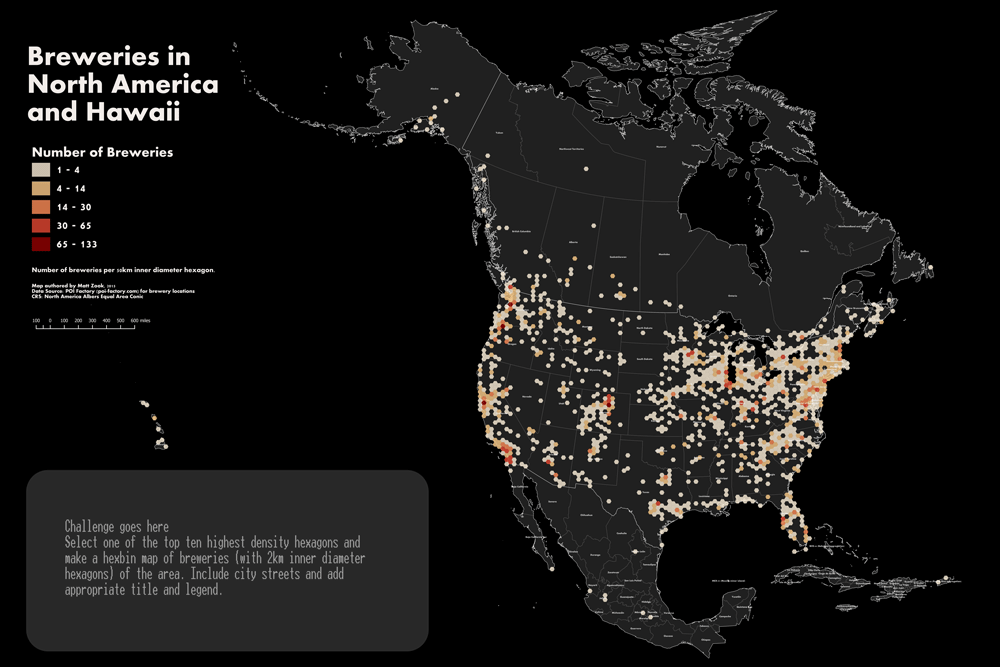
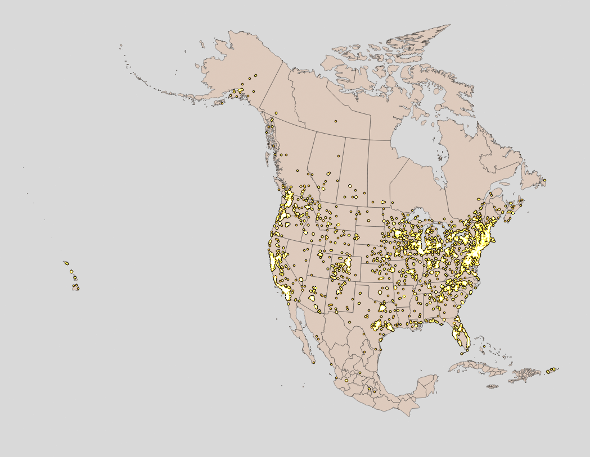
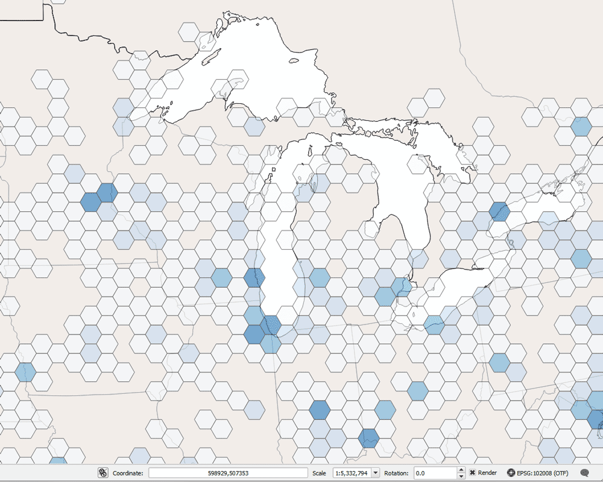
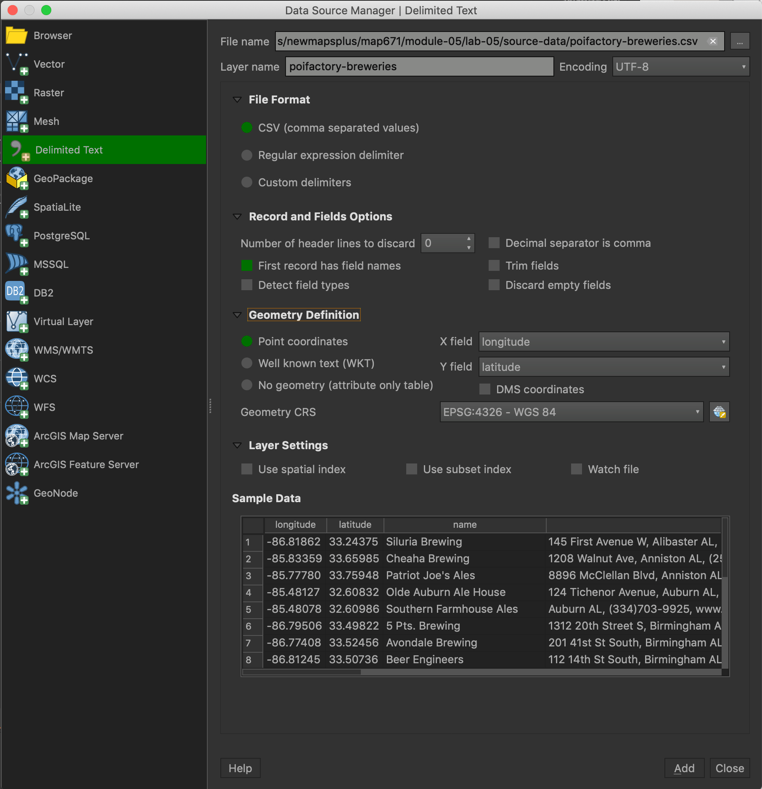

# Module 05 Lab Assignment

## Table of Contents

<!-- TOC -->

- [Module 05 Lab Assignment](#module-05-lab-assignment)
    - [Table of Contents](#table-of-contents)
    - [Hex binning North American breweries (10 pts)](#hex-binning-north-american-breweries-10-pts)
    - [Data](#data)
        - [Required specifications of the deliverable](#required-specifications-of-the-deliverable)
    - [Suggestions and Tips](#suggestions-and-tips)
    - [Addendum: Processing your own data](#addendum-processing-your-own-data)
        - [Instructions](#instructions)
            - [Query layers for North America](#query-layers-for-north-america)
            - [Import poifactory_breweries.csv](#import-poifactory_breweriescsv)

<!-- /TOC -->

The requirements of the map are listed below. All the tasks required to fulfill this assignment are documented within this and previous modules.


## Hex binning North American breweries (10 pts)

Aztec Aquaponics, a small company based out of Albuquerque, specializes in using beer brewing byproducts for their aquaponic operations. The produce sustainable fish and lettuce greens that supply an artisan fast-casual national restaurant chain. They have hired you to help locate their newest operation. They need to find high-density areas of breweries to maximize their aquaponic production. Their supply chain requires that they cannot transport the brewery byproducts more than 25 km. Where should they locate? Hex binning brewery locations in North America and Hawaii offers a potential solution.

## Data

Look on Canvas for the Geopackage **north-america-breweries.gpkg.zip**. This download should contain everything you need for this exercise. Source of the data:
* Breweries and brew pubs downloaded from [The POI Factory](http://poi-factory.com) on November 11, 2019.
* Countries (without lakes) and States (without lakes) [Natural Earth 1:10-million scale dataset](http://www.naturalearthdata.com)


### Required specifications of the deliverable

1) The final map must fulfill the following requirements. (4 pts)
> * The map must be a hexbin map that aggregates breweries by hexagons of no more than 50 km in length for the hexagon's long diagonal.
> * The coordinate reference system of the map must be North America Albers Equal Area Conic (EPSG: 102008).
> * Use layer transparency and blending modes to show state and country boundary lines and the classed hexbin. A viewer should be able to identify in what state and country a hexagon exists.
> * Hexagons with no breweries should not be symbolized.
> * Map must have a meaningful title and appropriate legend.
> * Map must include metadata information including the source of data and the projection information.

2) The client has also requested a copy of all point locations of breweries in GeoJSON format. The GeoJSON must fulfill the following requirements. (3 pts)

> * A coordinate reference system must be WGS84 (EPSG: 4326).
> * The coordinate precision should be set to two decimal places.
> * The fields for longitude and latitude should **not** be included as attributes.
> * Add the file to the *lab-05/geojson* folder.

3) The client has requested a web page that shows the static map(s) with link to a higher resolution version. This web page must meet the following requirements. (3 pts)

> * Map needs to be in two resolutions: 1) width of 1,200 px and 2) width of 8,000 px
> * Map image format should be a PNG or JPG.
> * A link must be available to access the higher resolution version and the GeoJSON.
> * The web page must have must have a meaningful title (both in the header title element and in the h1 element) and metadata about the author, data source, and brief description of how the map was made.
> * Map must include metadata information including the source and the projection information.
> * Contact information in footer must be tuned to you, the author.
> * The map page must be called "index.html" in the repo folder *lab-05/map*. The (private) URL should be similar to: _https://github.com/newmapsplus/map671-module-05-username/lab-05/map_
> * The [_lesson-map/index.html_](../lesson-map/index.html) provides a two-column web page template to help complete the challenge (below), though you can use any web page design.

4) Extra Challenge (+1 pt)
Select one of the top-ten highest density hexagons and make a hexbin map (in hexagons with 2 km length for long diagonals) or heat map of breweries of the area. Include brewery points, local roads, and add appropriate title and legend. Roads can be downloaded from the US Census Bureau's [TIGER/Line Shapefiles website](https://www.census.gov/cgi-bin/geo/shapefiles/index.php?year=2016&layergroup=Roads). Use the EPSG:102008 and rotate the inset so north is up. Add this as a separate map image on the web page. Find one photograph of this area and add it to the web page.

5) Super Extra Challenge: Send at least three barrels of the 2019 Thunderstruck IPA from Stone Brewing to PO Box 666, Lexington, KY 40666 via overnight USPS Food and Spirits special parcel.

## Suggestions and Tips

The final map could look like this, and you are welcome to add your sudsy glow:

    
*Example map layout*

1) Before you start your analysis, set up your map canvas to show the extent of the area of interest. Make a spatial bookmark to ensure that you can return to this exact position and scale:

    
*Extent of map and the location of breweries*

2) You can either calculate the hex grid on the brewery locations or countries layers. The key step is exporting your brewery locations to a layer projected to the EPSG: 102008 CRS.


3) Classify and symbolize your count field and visually inspect your output. Compare the number of points within a few hexagons and see if they're classified appropriately:

   
*Example of classed hexagonal grid*

4) Please note that this brewery list is increasing, so the legend values and point locations shown in the above maps will not match your values.

## Addendum: Processing your own data

Want to process the raw data? First, get the data from these sources:
* [poifactory_breweries.csv](source-data/poifactory-breweries.csv) layer showing over 9,000 breweries in North America 
* https://www.naturalearthdata.com/http//www.naturalearthdata.com/download/50m/cultural/ne_50m_admin_0_countries_lakes.zip
* https://www.naturalearthdata.com/http//www.naturalearthdata.com/download/50m/cultural/ne_50m_admin_1_states_provinces_lakes.zip

### Instructions

Use the following steps to start your project on a good path.

#### Query layers for North America

We don't need the entire world for our data. With the **Right-click > Layer > Filter** function or use SQL in DB Manager remove countries and states outside of North America.

```sql
# Where clause for Countries layer
"CONTINENT" = 'North America'
```

```sql
# Where clause for States layer
"adm0_a3" in ('CRI', 'NIC', 'MAF', 'SXM', 'HTI', 'DOM', 'SLV', 'GTM', 'USG', 'CUB', 'HND', 'USA', 'CAN', 'MEX', 'BLZ', 'PAN', 'GRL', 'CUW', 'ABW', 'BHS', 'TCA', 'SPM', 'TTO', 'GRD', 'VCT', 'BRB', 'LCA', 'DMA', 'UMI', 'MSR', 'ATG', 'KNA', 'VIR', 'BLM', 'PRI', 'AIA', 'VGB', 'JAM', 'CYM', 'BMU', 'BJN', 'SER')
```

#### Import poifactory_breweries.csv

Use the **Data Source Manager** to import the CSV. Enable **Geometry Definition > Point coordinates** and recognize that the x dimension is measured with longitude and the y dimension with latitude. Set the **Geometry CRS > EPSG: 4326 - WGS 84**

    
*Import CSV with geometry*

That's how the GeoPackage was created.
